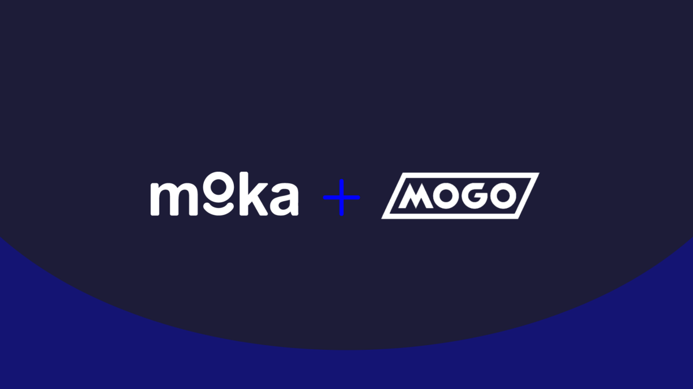

# Case Study Proposal: Moka + Mogo

## Overview
_______
Moka, formerly known as Mylo, was established in 2017 by Philip Barrar to help Canadians achieve financial goals. Moka introduced an intuitive feature that automatically rounds up daily purchases and invests the spare change in personalized portfolios of low-cost Exchange-Traded funds—making it easier for consumers to grow wealth, with no financial knowledge or investment capital required.

Mogo, on the other hand, was established in 2003. It is an online lending platform that offers various credit solutions to Canadians, from digital spending accounts to automatic carbon offsetting, bitcoin cashback and crypto investing, short-term loans and home mortgages.

As of March 23, 2021, Mogo Inc. has announced plans to acquire Moka to expand its services and introduce commission-free stock trading.

## Why This Matters
_______

The acquisition of Moka will bring Mogo in direct competition with the Toronto-based Fintech startup Wealthsimple, which currently provides Canada's most popular stock trading platform. Recently, Wealthsimple also introduced cypto trading in their platform. Establishing a market for new generations and introducing cryptocurrency as a new investment market. 

Integrating services from both companies will make their platform more robust and much more appealing to Millenials. Millenials gravitate towards these types of financial services as they are more accessible to them and does not require visits to a physical branch. 

Under the integrated platform, Moka-Mogo users can direct their automated round-ups towards personalized ETF or cryptocurrencies. At the same time, Moka-Mogo Prepaid Card users can trade bitcoin cashback rewards and redirect funds to their preferred investment accounts.

## Why this is interesting
_______

Mogo continues to acquire companies in the fintech and cryptocurrency space (i.e. Moka Financial, Carta Solutions and Fortification Capital). They are looking to accelerate their new product development, MogoTrade, a commission-free stock trading solution, while also improving and integrating services from the acquired companies. Moka-Mogo users will, later on, be able to also invest in another cryptocurrency other than bitcoin.

Investing in blockchain and fintech ecosystem is the new norm. Gradually, fintech companies are able to gain ground and raise awareness on the endless possibilities of blockchain in the financial space. 

## Thing to Keep in Mind 
_______

1. The technological and financial impact of innovative financial solutions towards traditional banking services.

2. Regulatory concerns as well as compliance surrounding blockchain technology.

3. Impact of the social mission of Mogo and company.

## References
_______

Barrar, P. (2021). Moka is joining forces with Mogo. Retrieved from https://magazine.moka.ai/2021/03/23/moka-is-joining-forces-with-mogo/

Businesswire (2021). Mogo to enter $4+ trillion Canadian Wealth Management Industry with acquisition of Leading Saving and Investing App, Moka Financial Technologies Inc. Retrieved from https://www.businesswire.com/news/home/20210323005632/en/Mogo-to-enter-4-trillion-Canadian-Wealth-Management-Industry-with-acquisition-of-Leading-Saving-and-Investing-App-Moka-Financial-Technologies-Inc.

Scott, J. (2021). Betakit: Canadian Startup News. Mogo to Acquire Moka in $64 Million Deal as it Looks to Launch Free Stock Trading. Retrieved from https://betakit.com/mogo-to-acquire-moka-in-64-million-deal-as-it-looks-to-launch-free-stock-trading/

Yahoo Finance (2021) Mogo Completes Acquisition of Canadian Investment Dealer Fortification Capital Inc. - to be Renamed MogoTrade Retrieved from https://finance.yahoo.com/news/mogo-completes-acquisition-canadian-investment-120800936.html

Kirsty (2021). What is Moka?. Retrieved from https://help.moka.ai/en/articles/3871938-what-is-moka

Moka (2021). About. Retrieved from https://moka.ai/en/about