# Proof of Authority Development Chain

For this project, we have to install the [Geth & Tools (1.9.7 version)](https://geth.ethereum.org/downloads/) and my [MyCrypto Desktop Application](https://download.mycrypto.com/) for your operating system.

``Notes: Ideally we do not want to post any of our keys to the public. Since we are using test tokens and test wallets for the purpose of the exercise we will upload them all in Git``

## Creation of a Genesis Block

1. Create 'unit18' folder in your chosen directory and unpack the Geth & Tools (1.9.7 version).
2. Open Git bash in windows or Terminal in Mac.
3. Run the following command: 
```
./puppeth
```
* Name the network ``unit18`` and hit enter to move forward in the wizard.
* Type ``2`` to pick ``configure new genesis`` option, to ``Create new genesis from scratch``:
* Type ``2`` to choose ``Proof of Authority`` and continue.


4. Geth will ask you to choose the accounts that are allowed to seal. Copy and paste an address from your Ethereum wallet in MyCrypto, without the ``0x`` prefix. 

* Once you paste an address and hit enter, hit enter again on the blank ``0x`` address to continue the prompt.

* Geth will now prompt you which accounts should be pre-funded. Just like the previous step copy and paste an address from your Ethereum wallet in MyCrypto, without the ``0x`` prefix

* You will be asked to enter a pre-fund account. You can choose ``No``. This keeps the genesis cleaner. I personally prefer to prefund both wallets. 

* Continue with the default option for the prompt that asks Should the precompile-addresses (0x1 .. 0xff) be pre-funded with 1 wei? by hitting enter again,
until you reach the Chain ID prompt.   

* Specify your own chain/network ID. For the project, use ``123``.

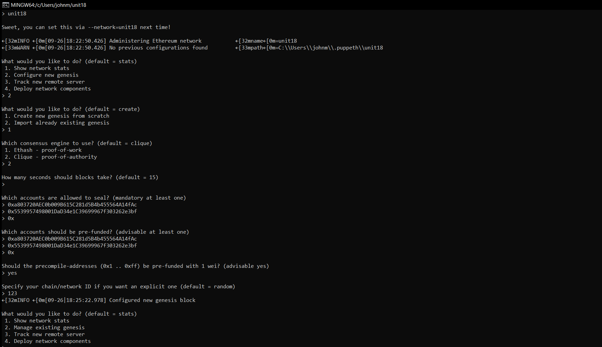

* Input `2` to manage existing genesis

* Input `2` to export genesis configurations 

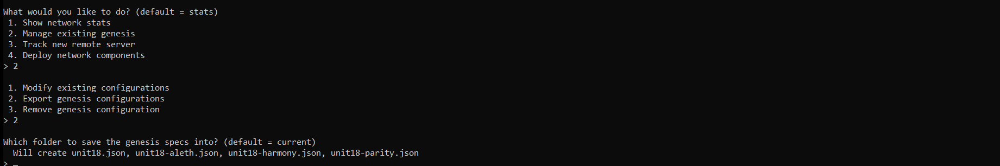

* Press enter in the prompt and you have the genesis specs created inside the designated directory.


# Creating the Nodes

For our project, we will have to create a new account for each of the two nodes in our network. We will do this using the following command: ``./geth account new --datadir node1`` 

1. Make sure to start another Git Bash or Terminal window. Cd into the correct directory where you unpacked the Ge t& Tools.

2. Enter the command ``./geth account new --datadir node1``. 

3. The terminal will ask you to input a password. We will use the password ``fintech18`` for both nodes. 

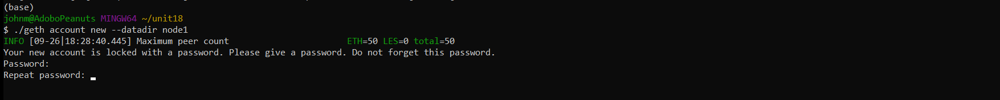

4.  public address of the key (the account) and the path of a secret key (keystore file) will be given. Make sure to save these. We need these later.

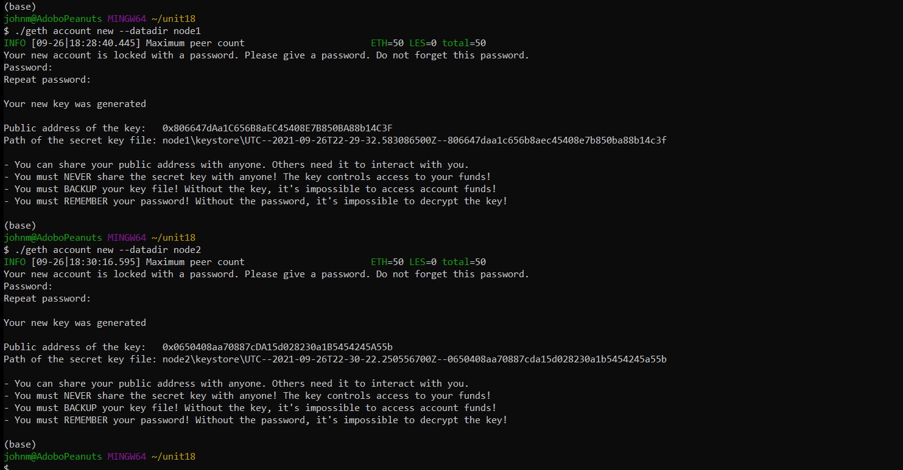

5. Enter the command ``./geth account new --datadir node2`` for the second node and repeat the process

6. Once finished, your directory should look similar to this:

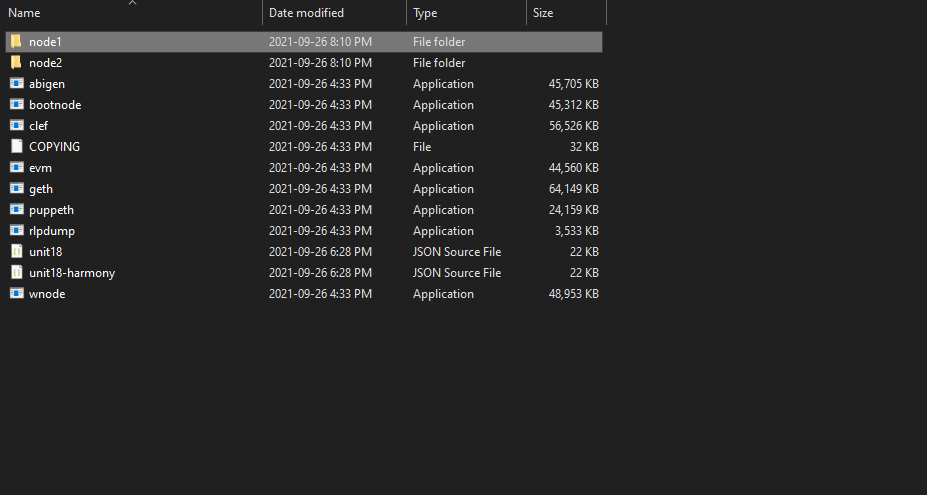
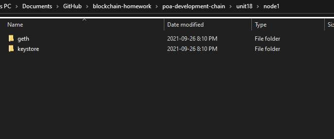
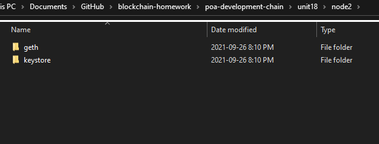

# Initializing the Nodes

Open two instances of Git bash or Terminal and make sure to be inside ``unit18`` folder.

1. Our first node will function as our bootnode. Input the following command:

``./geth --networkid 123 --datadir node1 --unlock "publicaddresskeyforwallet#1" --mine --rpc --allow-insecure-unlock``

2. For the second node. We will input the following command:

``./geth --networkid 123 --datadir node2 --unlock "publicaddresskeyforwallet#2" --mine --port 30304 --bootnodes "enodeofnode#1" --miner.threads 1``

3. If you followed the steps correctly. You will have two nodes booted up and running smoothly.


# Connecting to MyCrypto Desktop Application

1. Open MyCrypto desktop application and click on the change network at the bottom left of the window.

2. Click on ``add custom node`` to setup our test network.

3. In the ``Network`` tab select ``custom``.

4. Name the node ``unit18``, input ``ETH`` as the currency. Double check our nodes' network id and input ``123``. 

5. Input``http://127.0.0.1:8545`` as the URL.

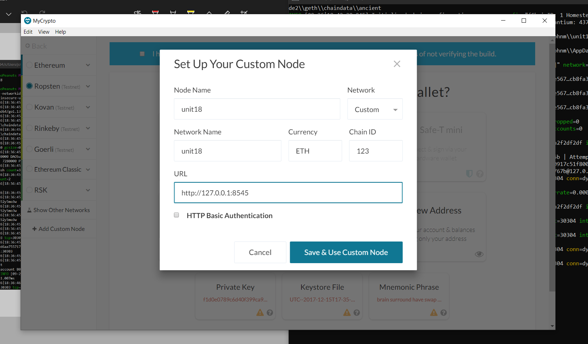

# Opening your wallet and transferring funds

Make sure to have both nodes running on the background before you open your wallet and access your account.

1. Import the keystore file from the ``node1/keystore`` directory into MyCrypto. This will import the private key. Make sure to input your password for our nodes ``fintech18``.

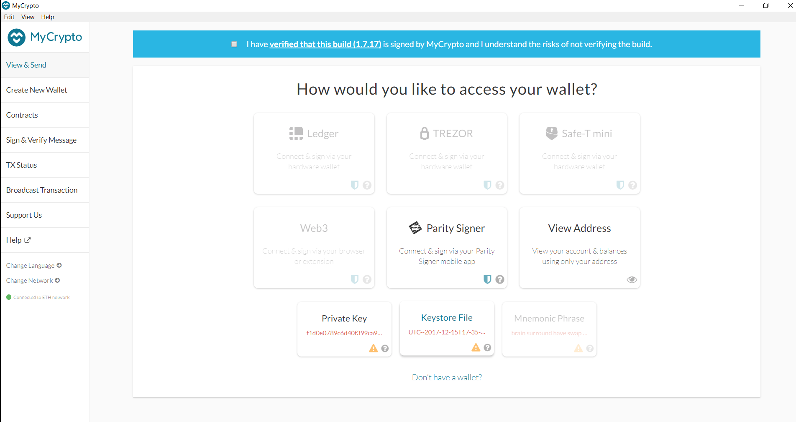

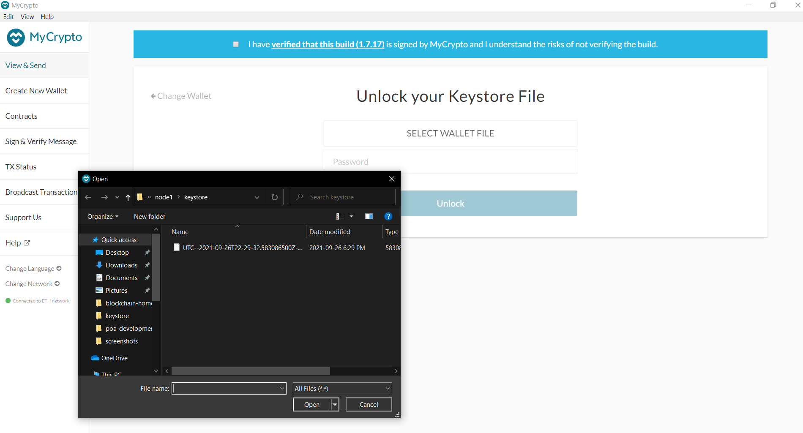

2. Send a transaction from the node1 account to the node2 account. I already have prefunded my wallets. In this case, I would like to send ``18 ETH`` to node 2

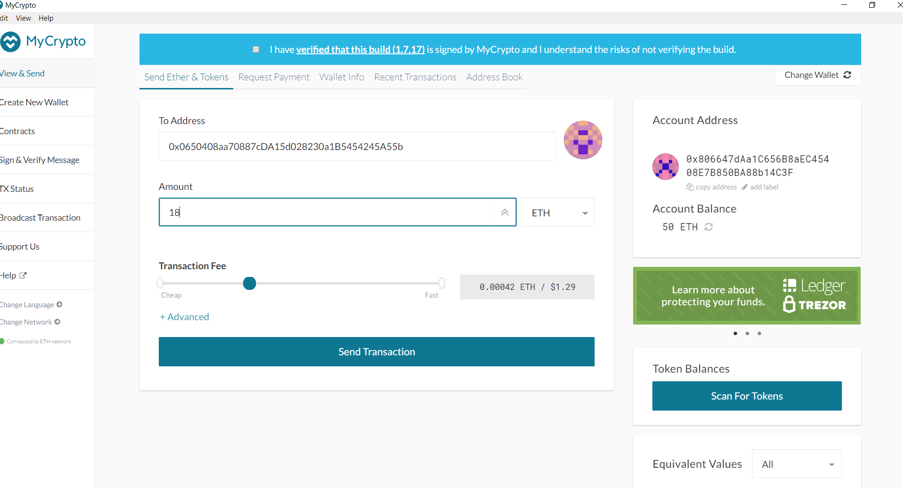

3. Confirm the transaction

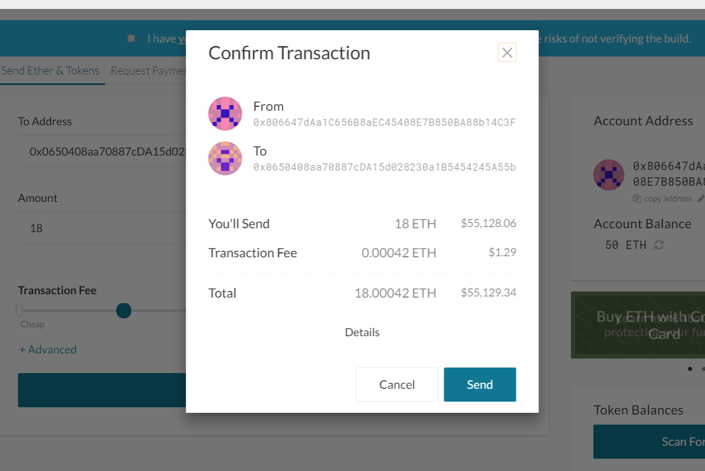

4. Make sure to copy the hash and paste it into the ``TX Status`` section of the application or click ``TX Status`` in the popup below.

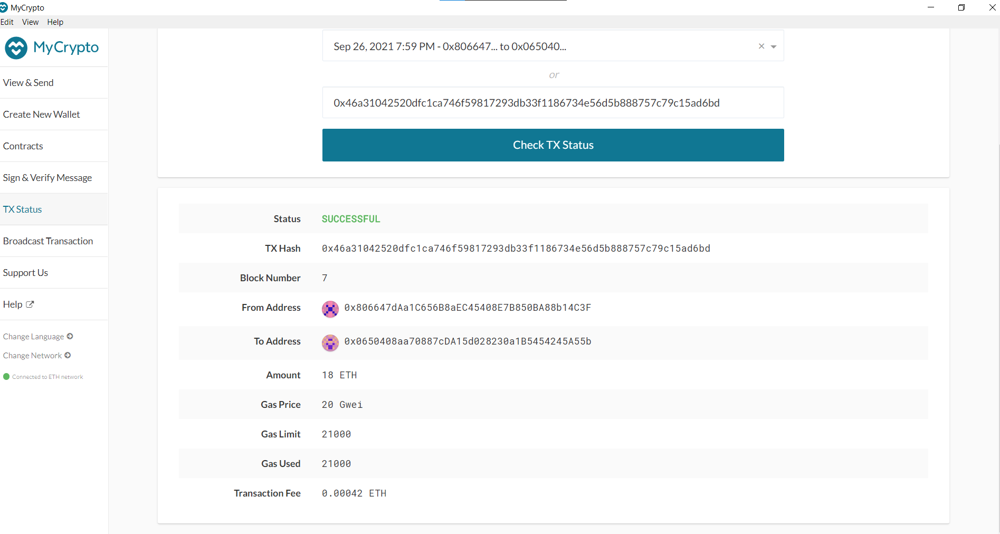

5. Check account balance. 

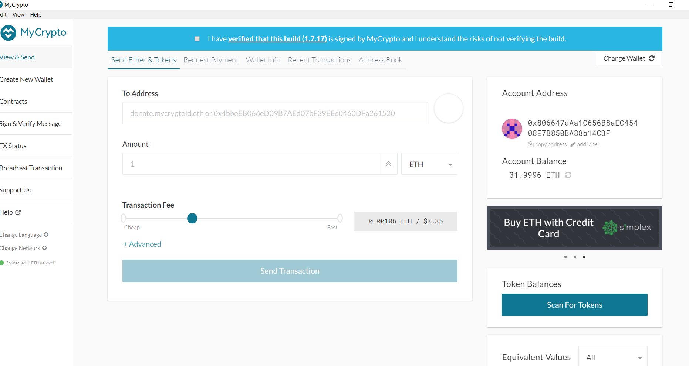

